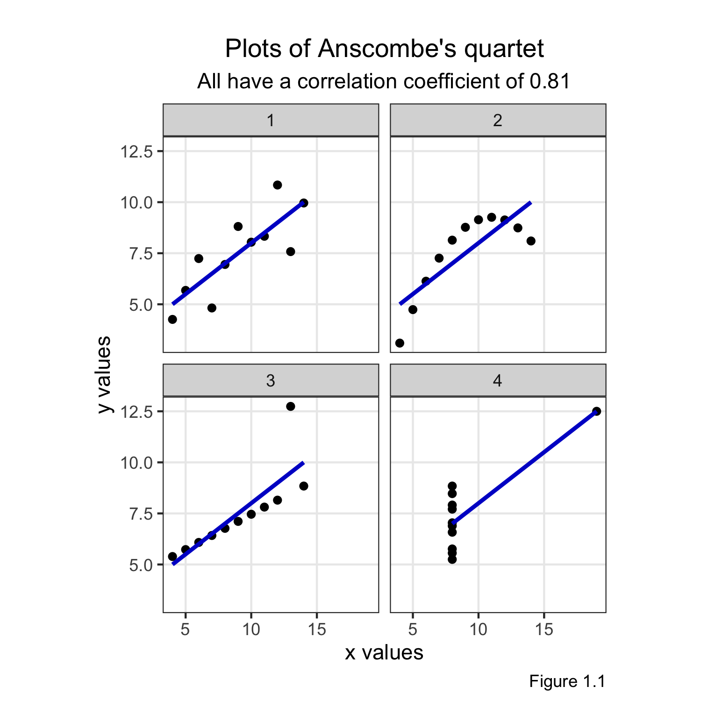

Look at data
================
Last updated in August 2020

## Preface

``` r
# Packages
library(tidyverse) # Wrangle and visualise data
library(knitr)     # Tidy output
library(here)      # Navigate files

# Plot setup
theme_set(theme_bw())
theme_update(
  aspect.ratio = 1,
  panel.grid.minor = element_blank(),
  plot.title = element_text(hjust = 0.5),
  plot.subtitle = element_text(hjust = 0.5),
  legend.position = "none"
)
```

## Plots of Ancombe’s quartet

``` r
# Inspect the data
kable(anscombe)
```

| x1 | x2 | x3 | x4 |    y1 |   y2 |    y3 |    y4 |
| -: | -: | -: | -: | ----: | ---: | ----: | ----: |
| 10 | 10 | 10 |  8 |  8.04 | 9.14 |  7.46 |  6.58 |
|  8 |  8 |  8 |  8 |  6.95 | 8.14 |  6.77 |  5.76 |
| 13 | 13 | 13 |  8 |  7.58 | 8.74 | 12.74 |  7.71 |
|  9 |  9 |  9 |  8 |  8.81 | 8.77 |  7.11 |  8.84 |
| 11 | 11 | 11 |  8 |  8.33 | 9.26 |  7.81 |  8.47 |
| 14 | 14 | 14 |  8 |  9.96 | 8.10 |  8.84 |  7.04 |
|  6 |  6 |  6 |  8 |  7.24 | 6.13 |  6.08 |  5.25 |
|  4 |  4 |  4 | 19 |  4.26 | 3.10 |  5.39 | 12.50 |
| 12 | 12 | 12 |  8 | 10.84 | 9.13 |  8.15 |  5.56 |
|  7 |  7 |  7 |  8 |  4.82 | 7.26 |  6.42 |  7.91 |
|  5 |  5 |  5 |  8 |  5.68 | 4.74 |  5.73 |  6.89 |

``` r
# Wrangle data
anscombe_cleaned <- anscombe %>% 
  # Add unique identifier per observation
  mutate(id = rownames(anscombe)) %>% 
  
  # Wide to long format
  pivot_longer(cols = c(starts_with("x"), starts_with("y")),
               names_to = "variable",
               values_to = "value") %>% 
  
  # Text parsing
  transmute(
    id = id,
    plot = str_sub(string = variable, start = 2, end = 2),
    axis = str_sub(string = variable, start = 1, end = 1),
    value = value
  ) %>% 
  
  # Long to wide format
  pivot_wider(names_from = axis, values_from = value)

# Inspect the cleaned data
kable(anscombe_cleaned)
```

| id | plot |  x |     y |
| :- | :--- | -: | ----: |
| 1  | 1    | 10 |  8.04 |
| 1  | 2    | 10 |  9.14 |
| 1  | 3    | 10 |  7.46 |
| 1  | 4    |  8 |  6.58 |
| 2  | 1    |  8 |  6.95 |
| 2  | 2    |  8 |  8.14 |
| 2  | 3    |  8 |  6.77 |
| 2  | 4    |  8 |  5.76 |
| 3  | 1    | 13 |  7.58 |
| 3  | 2    | 13 |  8.74 |
| 3  | 3    | 13 | 12.74 |
| 3  | 4    |  8 |  7.71 |
| 4  | 1    |  9 |  8.81 |
| 4  | 2    |  9 |  8.77 |
| 4  | 3    |  9 |  7.11 |
| 4  | 4    |  8 |  8.84 |
| 5  | 1    | 11 |  8.33 |
| 5  | 2    | 11 |  9.26 |
| 5  | 3    | 11 |  7.81 |
| 5  | 4    |  8 |  8.47 |
| 6  | 1    | 14 |  9.96 |
| 6  | 2    | 14 |  8.10 |
| 6  | 3    | 14 |  8.84 |
| 6  | 4    |  8 |  7.04 |
| 7  | 1    |  6 |  7.24 |
| 7  | 2    |  6 |  6.13 |
| 7  | 3    |  6 |  6.08 |
| 7  | 4    |  8 |  5.25 |
| 8  | 1    |  4 |  4.26 |
| 8  | 2    |  4 |  3.10 |
| 8  | 3    |  4 |  5.39 |
| 8  | 4    | 19 | 12.50 |
| 9  | 1    | 12 | 10.84 |
| 9  | 2    | 12 |  9.13 |
| 9  | 3    | 12 |  8.15 |
| 9  | 4    |  8 |  5.56 |
| 10 | 1    |  7 |  4.82 |
| 10 | 2    |  7 |  7.26 |
| 10 | 3    |  7 |  6.42 |
| 10 | 4    |  8 |  7.91 |
| 11 | 1    |  5 |  5.68 |
| 11 | 2    |  5 |  4.74 |
| 11 | 3    |  5 |  5.73 |
| 11 | 4    |  8 |  6.89 |

``` r
# Save the cleaned and raw datasets
write_rds(anscombe_cleaned, path = here("data", "anscombe_cleaned.rds"))
write_rds(anscombe, path = here("data", "anscombe_raw.rds"))
```

``` r
# Reproduce plots, with slight modification
anscombe_cleaned %>% 
  ggplot(aes(x = x, y = y)) +
    geom_point() +
    geom_smooth(formula = "y ~ x", method = "lm", se = FALSE, colour = "#6AAB9C") +
    facet_wrap(~plot) +
    labs(x = "x values",
         y = "y values",
         caption = "Figure 1.1",
         title = "\nPlots of Anscombe's quartet",
         subtitle = "All have a correlation coefficient of 0.81")
```



## Appendix

``` r
sessionInfo()
```

``` 
R version 4.0.1 (2020-06-06)
Platform: x86_64-apple-darwin17.0 (64-bit)
Running under: macOS Catalina 10.15.5

Matrix products: default
BLAS:   /Library/Frameworks/R.framework/Versions/4.0/Resources/lib/libRblas.dylib
LAPACK: /Library/Frameworks/R.framework/Versions/4.0/Resources/lib/libRlapack.dylib

locale:
[1] en_GB.UTF-8/en_GB.UTF-8/en_GB.UTF-8/C/en_GB.UTF-8/en_GB.UTF-8

attached base packages:
[1] stats     graphics  grDevices utils     datasets  methods   base     

other attached packages:
 [1] here_0.1        knitr_1.28      forcats_0.5.0   stringr_1.4.0  
 [5] dplyr_1.0.1     purrr_0.3.4     readr_1.3.1     tidyr_1.1.0    
 [9] tibble_3.0.3    ggplot2_3.3.2   tidyverse_1.3.0

loaded via a namespace (and not attached):
 [1] tidyselect_1.1.0 xfun_0.15        lattice_0.20-41  splines_4.0.1   
 [5] haven_2.3.1      colorspace_1.4-1 vctrs_0.3.2      generics_0.0.2  
 [9] htmltools_0.5.0  mgcv_1.8-31      yaml_2.2.1       blob_1.2.1      
[13] rlang_0.4.7      pillar_1.4.6     glue_1.4.1       withr_2.2.0     
[17] DBI_1.1.0        dbplyr_1.4.4     modelr_0.1.8     readxl_1.3.1    
[21] lifecycle_0.2.0  munsell_0.5.0    gtable_0.3.0     cellranger_1.1.0
[25] rvest_0.3.5      evaluate_0.14    labeling_0.3     fansi_0.4.1     
[29] highr_0.8        broom_0.7.0      Rcpp_1.0.5       scales_1.1.1    
[33] backports_1.1.8  jsonlite_1.6.1   farver_2.0.3     fs_1.5.0        
[37] hms_0.5.3        digest_0.6.25    stringi_1.4.6    grid_4.0.1      
[41] rprojroot_1.3-2  cli_2.0.2        tools_4.0.1      magrittr_1.5    
[45] crayon_1.3.4     pkgconfig_2.0.3  Matrix_1.2-18    ellipsis_0.3.1  
[49] xml2_1.3.2       reprex_0.3.0     lubridate_1.7.9  assertthat_0.2.1
[53] rmarkdown_2.3    httr_1.4.1       rstudioapi_0.11  R6_2.4.1        
[57] nlme_3.1-148     compiler_4.0.1  
```
