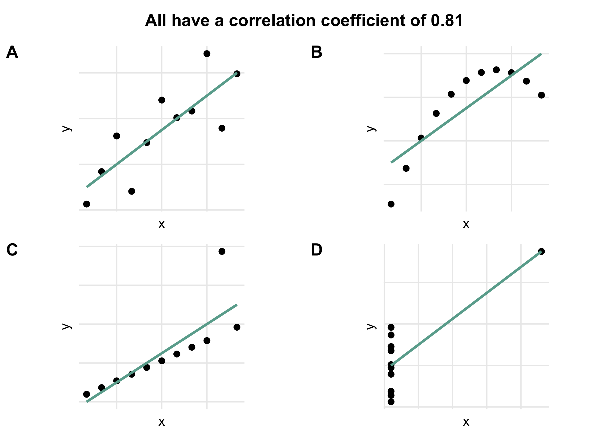

Look at data
================
Last updated: August 2020

## Preface

``` r
# Packages
library(tidyverse) # Wrangle and visualise data
library(cowplot)   # Combine plots

# Plot setup
theme_set(theme_minimal())
theme_update(
  aspect.ratio = 1,
  panel.grid.minor = element_blank(),
  axis.text.x = element_blank(),
  axis.text.y = element_blank(),
  axis.ticks = element_blank(),
  legend.position = "none"
)
```

## Plots of Ancombe’s quartet

``` r
p1 <- anscombe %>%
  ggplot(mapping = aes(x = x1, y = y1)) +
    geom_point(size = 2) +
    geom_smooth(formula = "y ~ x", method = "lm", se = FALSE, colour = "#6AAB9C") +
    labs(x = "x", y = "y")

p2 <- anscombe %>%
  ggplot(mapping = aes(x = x2, y = y2)) +
    geom_point(size = 2) +
    geom_smooth(formula = "y ~ x", method = "lm", se = FALSE, colour = "#6AAB9C") +
    labs(x = "x", y = "y")

p3 <- anscombe %>%
  ggplot(mapping = aes(x = x3, y = y3)) +
    geom_point(size = 2) +
    geom_smooth(formula = "y ~ x", method = "lm", se = FALSE, colour = "#6AAB9C") +
    labs(x = "x", y = "y")

p4 <- anscombe %>%
  ggplot(mapping = aes(x = x4, y = y4)) +
    geom_point(size = 2) +
    geom_smooth(formula = "y ~ x", method = "lm", se = FALSE, colour = "#6AAB9C") +
    labs(x = "x", y = "y")

plot_grid(p1, p2, p3, p4, ncol = 2, labels = LETTERS[1:4])
```



## Appendix

``` r
sessionInfo()
```

``` 
R version 4.0.1 (2020-06-06)
Platform: x86_64-apple-darwin17.0 (64-bit)
Running under: macOS Catalina 10.15.5

Matrix products: default
BLAS:   /Library/Frameworks/R.framework/Versions/4.0/Resources/lib/libRblas.dylib
LAPACK: /Library/Frameworks/R.framework/Versions/4.0/Resources/lib/libRlapack.dylib

locale:
[1] en_GB.UTF-8/en_GB.UTF-8/en_GB.UTF-8/C/en_GB.UTF-8/en_GB.UTF-8

attached base packages:
[1] stats     graphics  grDevices utils     datasets  methods   base     

other attached packages:
 [1] cowplot_1.0.0   forcats_0.5.0   stringr_1.4.0   dplyr_1.0.1    
 [5] purrr_0.3.4     readr_1.3.1     tidyr_1.1.0     tibble_3.0.3   
 [9] ggplot2_3.3.2   tidyverse_1.3.0

loaded via a namespace (and not attached):
 [1] tidyselect_1.1.0 xfun_0.15        lattice_0.20-41  splines_4.0.1   
 [5] haven_2.3.1      colorspace_1.4-1 vctrs_0.3.2      generics_0.0.2  
 [9] htmltools_0.5.0  yaml_2.2.1       mgcv_1.8-31      blob_1.2.1      
[13] rlang_0.4.7      pillar_1.4.6     glue_1.4.1       withr_2.2.0     
[17] DBI_1.1.0        dbplyr_1.4.4     modelr_0.1.8     readxl_1.3.1    
[21] lifecycle_0.2.0  munsell_0.5.0    gtable_0.3.0     cellranger_1.1.0
[25] rvest_0.3.5      evaluate_0.14    labeling_0.3     knitr_1.28      
[29] fansi_0.4.1      broom_0.7.0      Rcpp_1.0.5       scales_1.1.1    
[33] backports_1.1.8  jsonlite_1.6.1   farver_2.0.3     fs_1.5.0        
[37] hms_0.5.3        digest_0.6.25    stringi_1.4.6    grid_4.0.1      
[41] cli_2.0.2        tools_4.0.1      magrittr_1.5     crayon_1.3.4    
[45] pkgconfig_2.0.3  Matrix_1.2-18    ellipsis_0.3.1   xml2_1.3.2      
[49] reprex_0.3.0     lubridate_1.7.9  assertthat_0.2.1 rmarkdown_2.3   
[53] httr_1.4.1       rstudioapi_0.11  R6_2.4.1         nlme_3.1-148    
[57] compiler_4.0.1  
```
